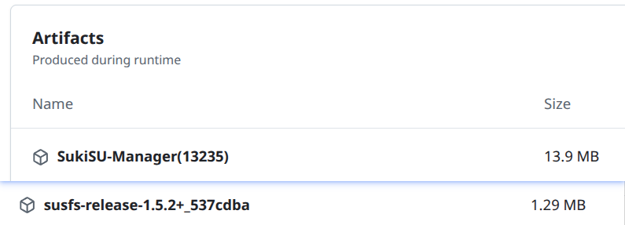
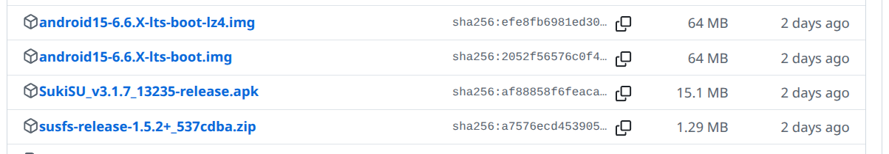

### 这是一个自动构建GKI内核的仓库

> 非GKI可以尝试[SukiSU云盘](https://alist.shirkneko.top)的资源，不支持一加ColorOS14、15
>
> 第一次使用务必**详细阅读**以下内容，不要因为懒惰而占用他人时间！
>
> 因SUKISU和NEXT已不在维护旧版本susfs的分支，编译时你无论选择Dev或Stable，都是一样的结果；
>且mksu也无标准/开发版本概念，无论选择哪个都一样，但（KSU的稳定版是最新TAG，也就是[v1.0.5](https://github.com/tiann/KernelSU/tree/v1.0.5)，4月22日发布的那个）
> 
> 最近更新：
> 1. 全部 KSU 恢复更新，SUSFS 1.5.10，ksu和mksu切换为kprobe钩子正常使用

### 无限重启？
1. 一加：colorOS15魔改过f2fs，已经不兼容GKI的f2fs，除非进入rec清除Data重启
2. 小米：一些机型因为启动引导因avb验证导致无法启动分区，如红米k50，需要关闭avb验证（https://magiskcn.com/disable-avb）
3. zram:一些机型或系统使用了带zram补丁的内核也可能，遇到该情况可以刷[Release](https://github.com/zzh20188/GKI_KernelSU_SUSFS/releases)中不带zram的内核，或者在编译选项中不勾选[增加更多ZRAM算法]以编译无zram的内核
4. 其他：其他手机也可能因为相似的兼容问题，如果有可以补充。。。

### Tips
1. 关于安全补丁
    - 手机设置里的安全补丁时间与GKI内核的安全补丁时间**无关**，请无视它
2. 关于android版本
    - 手机系统的安卓版本与GKI内核的安卓版本无关，应当对照手机内核版本的 **android**
    - 假设手机设置的内核版本为 5.10.66-**android12**-9-00001-g41ff3fa8fop9-ab8161528
    - 那么你需要刷入[在此](https://github.com/zzh20188/GKI_KernelSU_SUSFS/releases)下载的 **android12**-5.10.66-2022-01-AnyKernel3.zip 文件

### 下载
可以[在此](https://github.com/zzh20188/GKI_KernelSU_SUSFS/releases)下载您的资源
1. 关于Anykernel3.zip，下载即用！
   - 然后使用刷入软件，例如[HorizonKernelFlasher](https://github.com/libxzr/HorizonKernelFlasher/releases)进行刷写内核
2. 关于boot.img，下载与你内核格式相匹配的（无压缩、gz、lz4），[参考](https://kernelsu.org/zh_CN/guide/installation.html#install-by-kernelsu-boot-image) **找到合适的 boot.img** 一节
    - 使用[FASTBOOT](https://magiskcn.com/)刷入，或者使用刷写软件刷写到ROOT所在插槽的boot分区(例如爱玩机、Kernelflasher)


### 支持
| 功能 | 说明 |
| --- | --- |
| [KernelSU](https://kernelsu.org/zh_CN/) | 包括**原版、MKSU、SUKISU、NEXT** |
| [SUSFS4](https://gitlab.com/simonpunk/susfs4ksu) | 在内核层面辅助KSU隐藏的功能补丁 |
| [LZ4KD](https://github.com/ShirkNeko/SukiSU_patch/tree/main/other) | 听说是来自HUAWEI source的ZRAM算法，补丁由[云彩之枫](http://www.coolapk.com/u/24963680)移植 |
| [LZ4 1.10.0](https://github.com/lz4/lz4/releasesr) | GKI内核默认的LZ4算法升级 |

<details>

<summary>还支持这几种算法，可在scene的ZRAM切换</summary>

### LZ4K、LZ4HC、deflate、842、~~zstdn~~、lz4k_oplus

</details>

### KSU管理器 & SUSFS模块
由于一些原因，你不可缺少最新管理器和模块(见下)
> ##### 如果长期不更新管理器，而只更新内核也就是使用ak3刷入，那么软件显示可能异常，会显得你和别人不一样，如SUKISU显示LKM，NEXT一些参数显示未知
> ##### SUKISU内置SUSFS功能相对模块，缺失try mount/umount数量显示功能，以及自定义界面的一些选项
#### 在编译完成后，你会看到类似 `SukiSU-Manager(13235)` 和 `susfs-release-1.5.2+_537cdba` 的压缩包，简单来说这就是与内核一同上传的***最新管理器与susfs模块***。



#### 同样的，在[Release](https://github.com/zzh20188/GKI_KernelSU_SUSFS/releases)的底部也同样包含它们




### 内核构建时间
在构建内核时，可以指定内核的构建时间。在Action的输入框中输入指定格式的字符即可。
如：**Thu Jul 17 14:26:50 UTC 2025**
> 这个时间表示的是2025年7月17日的14:26:50（协调世界时间，UTC）。
当你没有输入指定时间，则为构建内核时的时间


### 紧急救援指南

> [!IMPORTANT]
> **触发条件**  
> 当设备因以下原因无法启动时需执行救援：  
> - 刷入错误/不兼容的内核
> - 内核版本适配异常（如5.10.66刷233版本的内核）
1. 进入FASTBOOT模式

- 物理键组合：电源+音量- 或者 ADB命令： `adb reboot bootloader`

2. 执行刷写命令
```bash
$ fastboot flash boot <boot.img文件全称>
```
### 原版镜像获取途径
1. 从现有固件提取

- 卡刷包：解压后使用[payload-dumper工具](https://magiskcn.com/payload-dumper-go-boot.html)

- 线刷包：直接解压获取boot.img

2.外部资源获取

- 社区平台搜索：机型+原厂boot (如XDA/酷安)

- [移动端在线提取远程获取](https://magiskcn.com/payload-dumper-compose.html)

> [!TIP]
> ### 内核版本兼容性说明
> 
> **1. 跨子版本刷机规则**  
> 当手机GKI主版本为5.10.x时（如5.10.168），可刷写同主版本更高子版本的内核（如5.10.198）。  
> 关于**X-lts**版本，以 `android12-5.10.X-lts-AnyKernel3.zip` 为例：
> - **X-lts** 表示长期支持版（子版本号最大，当前示例为5.10.238）
> - LTS随着GKI源码更新，编译版本号将持续递增（其他如198的版本，是永久固定的）
> - ⚠️ 注意：LTS虽为最新，**但**最新版≠最稳定（如6.6.x存在自动重启BUG）
> 
> **2. 内核版本伪装方法**  
> 在MT管理器终端执行：
> ```bash
> uname -r | sed 's/^[^-]*//'
> ```
> 获取后直接复制，将此版本号填入Action编译面板即可实现内核版本伪装。
> 
> **3. 编译优化建议**  
> 修改 [配置文件](.github/workflows/kernel-a12-5.10.yml)（如kernel-a12-5.10.yml）：
> - ▶️ 删除/注释不需要的GKI版本配置（**加速编译**）

### 更多内容
可以提及您的意见...我会尝试！
